```{r setup, include=FALSE}
knitr::opts_chunk$set(echo = TRUE)
```

<br/>


# Data preparation {.tabset}

## Unfiltered

<center>
<a href="https://raw.githubusercontent.com/tklammsteiner/ehil/main/docs/output/16S-rarecurve_unfiltered.png">
    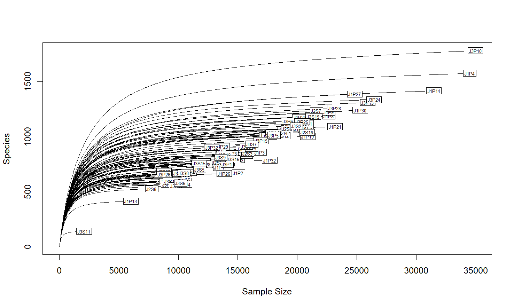</a>
    
<figcaption align = "center">
    <b>Fig. 1</b> - Rarefaction curve of unfiltered data.</figcaption>

<p>*click figure to see larger version*</p>
</center>

## Filtered

<center>
<a href="https://raw.githubusercontent.com/tklammsteiner/ehil/main/docs/output/16S-rarecurve_filtered.png">
    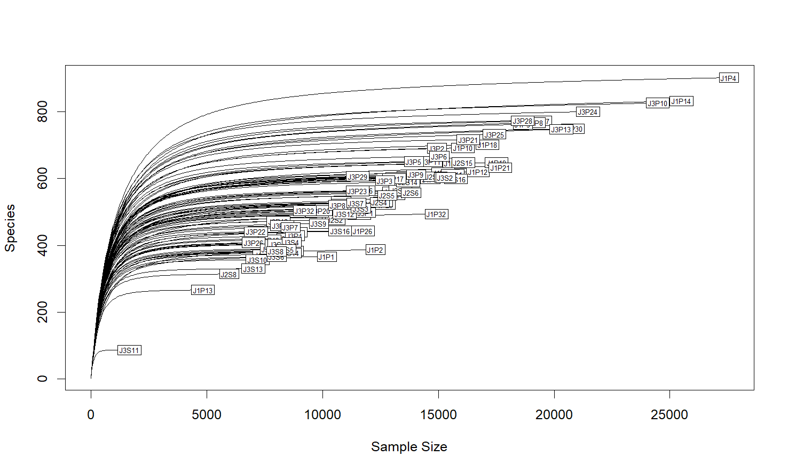</a>
    
<figcaption align = "center">
    <b>Fig. 2</b> - Rarefaction curve of filtered data. The filter was set to in include ASVs with at least 2 reads in at least 10% of all samples.</figcaption>

<p>*click figure to see larger version*</p>
</center>

## Rarefied (smallest sample)

<center>
<a href="https://raw.githubusercontent.com/tklammsteiner/ehil/main/docs/output/16S-rarecurve_filtr1.png">
    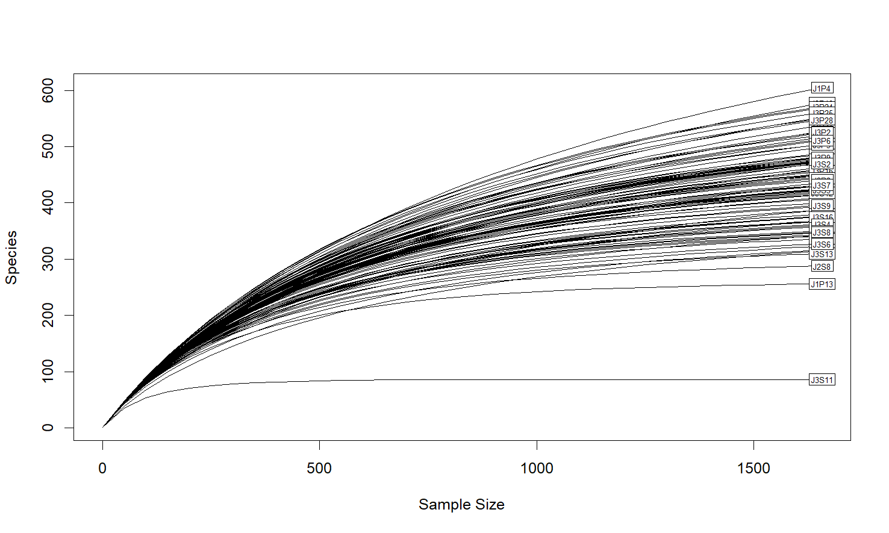</a>
    
<figcaption align = "center">
    <b>Fig. 3</b> - Rarefaction curve of filtered and rarefied data. The data were rarefied to the smallest sample size.</figcaption>

<p>*click figure to see larger version*</p>
</center>

## Rarefied (outlier removed)

<center>
<a href="https://raw.githubusercontent.com/tklammsteiner/ehil/main/docs/output/16S-rarecurve_filtr2.png">
    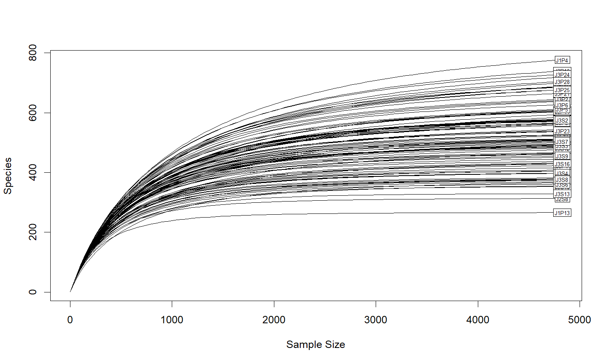</a>
    
<figcaption align = "center">
    <b>Fig. 4</b> - Rarefaction curve of filtered and rarefied data. The data were rarefied to the second smallest sample size, thereby exluding the smallest sample as an outlier.</figcaption>

<p>*click figure to see larger version*</p>
</center>

# {.unlisted .unnumbered}
<br/>

# Community composition 
## Stams {.tabset}
### Single samples (full dataset)

<center>
<a href="https://raw.githubusercontent.com/tklammsteiner/ehil/main/docs/output/16S-phylum_stams.png">
    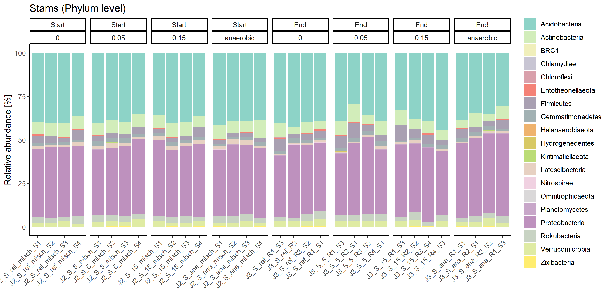</a>
    
<figcaption align = "center">
    <b>Fig. 5</b> - Community composition at phylum level for each sample of the full dataset including the outlier J3S11 (J3_S_15_R3_S4).</figcaption>

<p>*click figure to see larger version*</p>
</center>

### Grouped samples (full dataset)

<center>
<a href="https://raw.githubusercontent.com/tklammsteiner/ehil/main/docs/output/16S-phylum_stams_mean.png">
    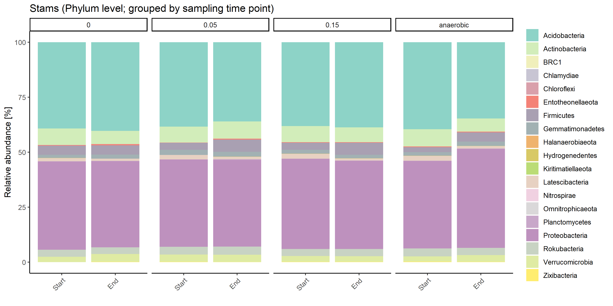</a>
    
<figcaption align = "center">
    <b>Fig. 6</b> - Average community composition at phylum level for samples grouped at sampling time point (Full dataset including the outlier J3S11 (J3_S_15_R3_S4)).</figcaption>

<p>*click figure to see larger version*</p>
</center>

### Single samples (outlier removed)

<center>
<a href="https://raw.githubusercontent.com/tklammsteiner/ehil/main/docs/output/16S-phylum_stams_sub.png">
    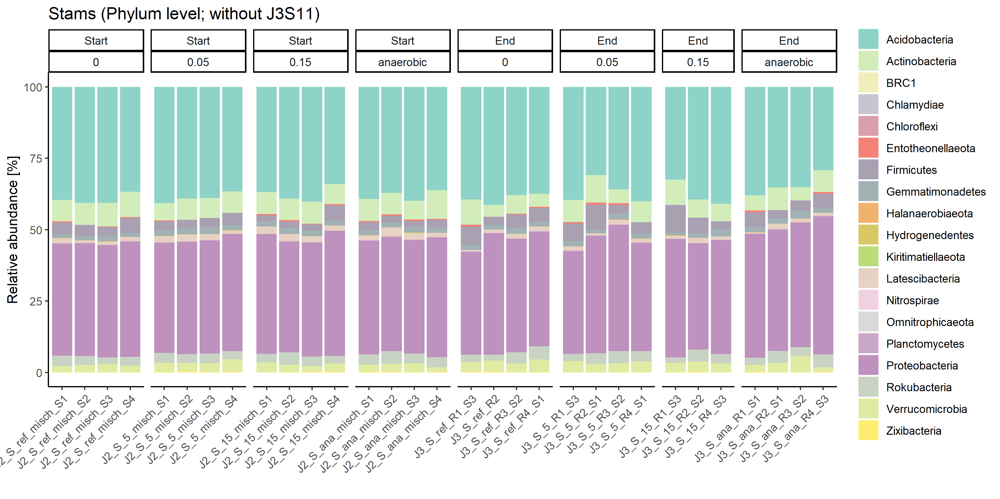</a>
    
<figcaption align = "center">
    <b>Fig. 7</b> - Community composition at phylum level for each sample of the dataset without outlier J3S11 (J3_S_15_R3_S4).</figcaption>

<p>*click figure to see larger version*</p>
</center>

### Grouped samples (outlier removed)

<center>
<a href="https://raw.githubusercontent.com/tklammsteiner/ehil/main/docs/output/16S-phylum_stams_sub_mean.png">
    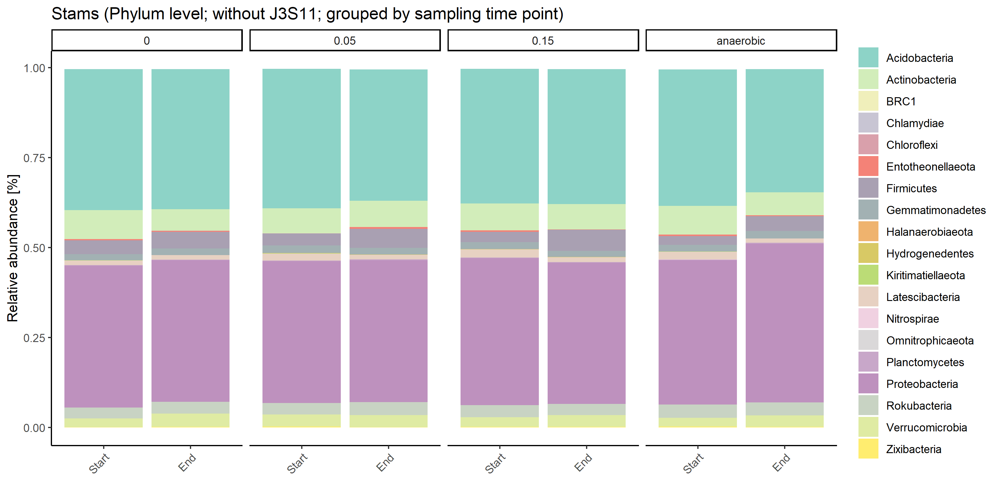</a>
    
<figcaption align = "center">
    <b>Fig. 8</b> - Average community composition at phylum level for samples grouped at sampling time point (Dataset without outlier J3S11 (J3_S_15_R3_S4)).</figcaption>

<p>*click figure to see larger version*</p>
</center>

# {.unlisted .unnumbered}
<br/>

## Pill {.tabset}
### Single samples

<center>
<a href="https://raw.githubusercontent.com/tklammsteiner/ehil/main/docs/output/16S-phylum_pill.png">
    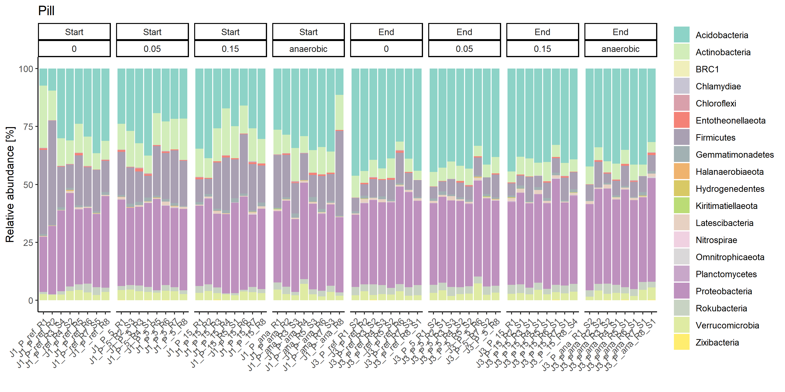</a>
    
<figcaption align = "center">
    <b>Fig. 9</b> - Community composition at phylum level for samples collected in Pill.</figcaption>

<p>*click figure to see larger version*</p>
</center>

### Grouped samples

<center>
<a href="https://raw.githubusercontent.com/tklammsteiner/ehil/main/docs/output/16S-phylum_pill_mean.png">
    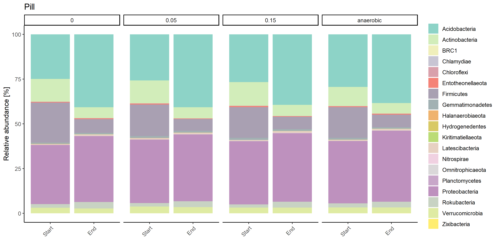</a>
    
<figcaption align = "center">
    <b>Fig. 10</b> - Average community composition at phylum level for samples collected in Pill grouped at sampling time point.</figcaption>

<p>*click figure to see larger version*</p>
</center>

# {.unlisted .unnumbered}
<br/>

# Alpha diversity {.tabset}
## Stams (full dataset)

<center>
<a href="https://raw.githubusercontent.com/tklammsteiner/ehil/main/docs/output/16S-alpha_stams_full.png">
    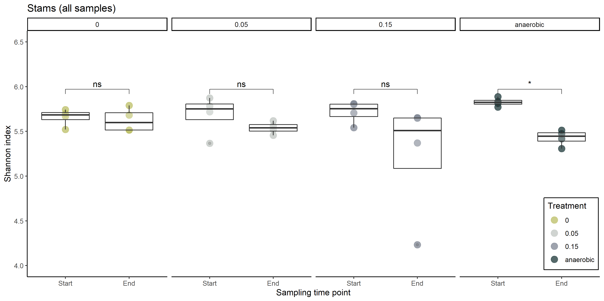</a>
    
<figcaption align = "center">
    <b>Fig. 11</b> - Alpha diversity (full dataset).</figcaption>

<p>*click figure to see larger version*</p>
</center>

## Stams (outlier removed)

<center>
<a href="https://raw.githubusercontent.com/tklammsteiner/ehil/main/docs/output/16S-alpha_stams_sub.png">
    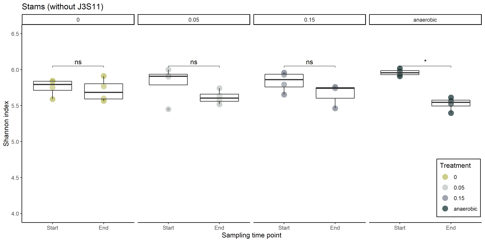</a>
    
<figcaption align = "center">
    <b>Fig. 12</b> - Alpha diversity (outlier removed).</figcaption>

<p>*click figure to see larger version*</p>
</center>

## Pill (full dataset)

<center>
<a href="https://raw.githubusercontent.com/tklammsteiner/ehil/main/docs/output/16S-alpha_pill.png">
    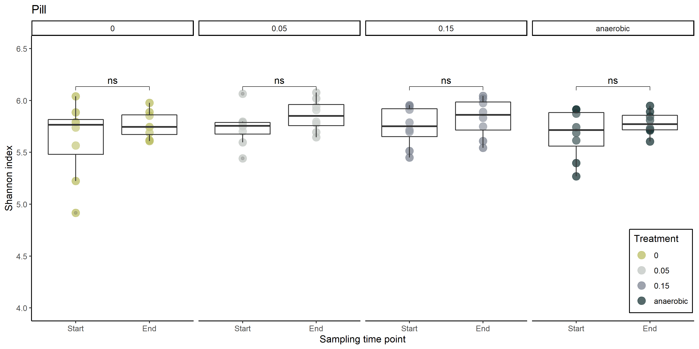</a>
    
<figcaption align = "center">
    <b>Fig. 13</b> - Alpha diversity.</figcaption>

<p>*click figure to see larger version*</p>
</center>

# {.unlisted .unnumbered}
<br/>


# Differntial abundance {.tabset}
## Stams

<center>
<a href="https://raw.githubusercontent.com/tklammsteiner/ehil/main/docs/output/16S-lefse-stams.png">
    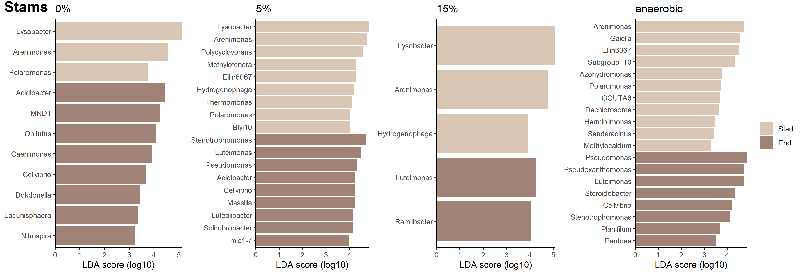</a>
    
<figcaption align = "center">
    <b>Fig. 14</b> - Linear discriminant analysis of effect size for each treatment in Stams (before/after).</figcaption>

<p>*click figure to see larger version*</p>
</center>

## Pill

<center>
<a href="https://raw.githubusercontent.com/tklammsteiner/ehil/main/docs/output/16S-lefse-pill.png">
    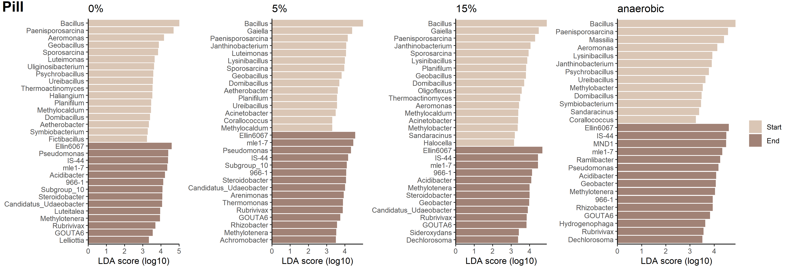</a>
    
<figcaption align = "center">
    <b>Fig. 15</b> - Linear discriminant analysis of effect size for each treatment in Pill (before/after).</figcaption>

<p>*click figure to see larger version*</p>
</center>


# {.unlisted .unnumbered}
<br/>

# Ordination {.tabset}
## Stams

<center>
<a href="https://raw.githubusercontent.com/tklammsteiner/ehil/main/docs/output/16S-nmds-stams.png">
    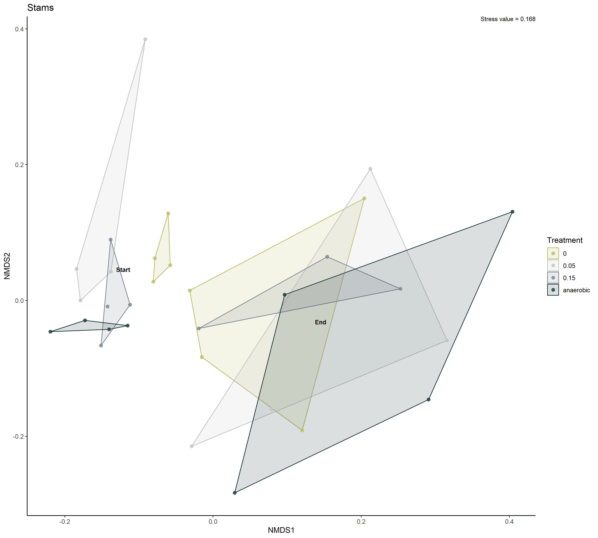</a>
    
<figcaption align = "center">
    <b>Fig. 16</b> - Non-metric multidimensional scaling for samples collected in Stams.</figcaption>

<p>*click figure to see larger version*</p>
</center>

## Pill

<center>
<a href="https://raw.githubusercontent.com/tklammsteiner/ehil/main/docs/output/16S-nmds-pill.png">
    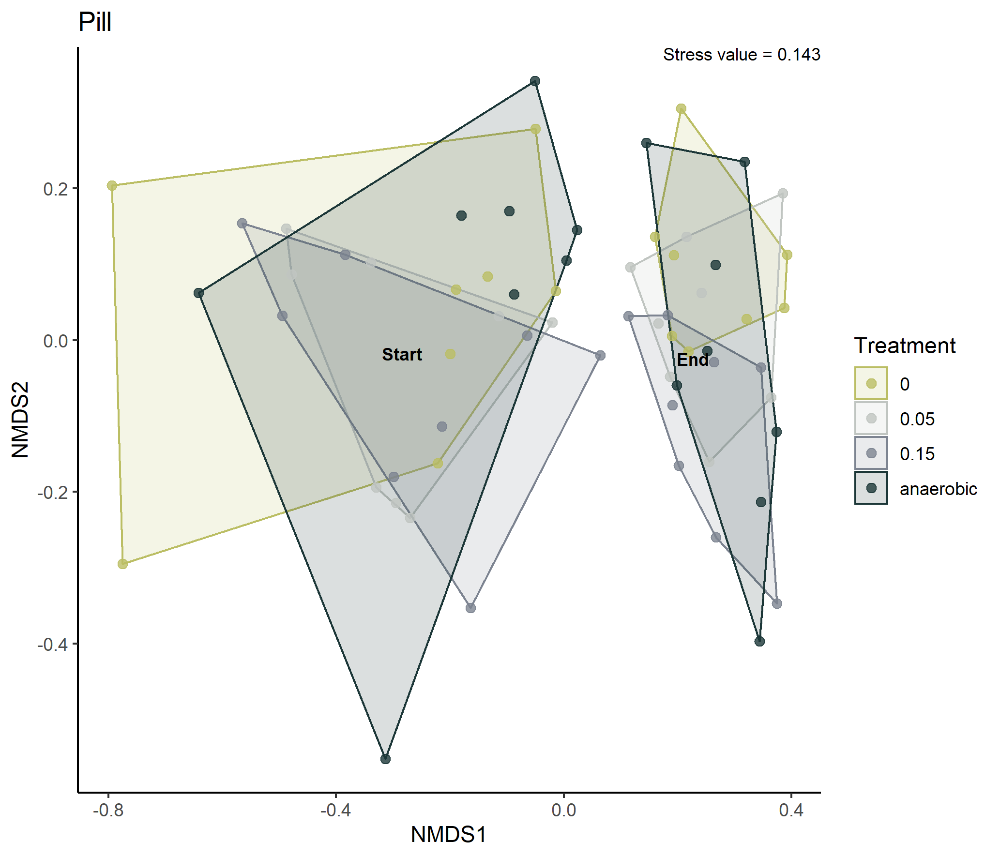</a>
    
<figcaption align = "center">
    <b>Fig. 17</b> - Non-metric multidimensional scaling for samples collected in Pill.</figcaption>

<p>*click figure to see larger version*</p>
</center>